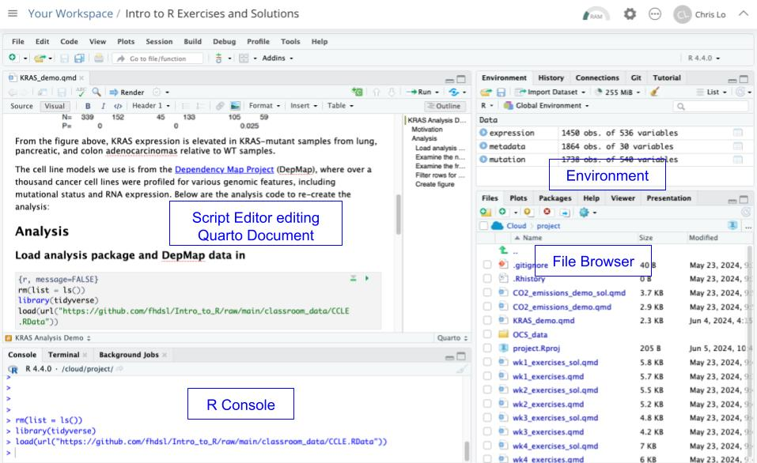

# Intro to Computing

Welcome to Introduction to R! Each week, we cover a chapter, which consists of a lesson and exercise. In our first week together, we will look at big conceptual themes in programming, see how code is run, and learn some basic grammar structures of programming.

## Goals of the course

In the next 6 weeks, we will explore:

-   Fundamental concepts in high-level programming languages (R, Python, Julia, WDL, etc.) that is transferable: *How do programs run, and how do we solve problems using functions and data structures?*

-   Beginning of data science fundamentals: *How do you translate your scientific question to a data wrangling problem and answer it?*

    .](https://d33wubrfki0l68.cloudfront.net/571b056757d68e6df81a3e3853f54d3c76ad6efc/32d37/diagrams/data-science.png){width="450"}

-   Find a nice balance between the two throughout the course: we will try to reproduce a figure from a scientific publication using new data.

## What is a computer program?

-   A sequence of instructions to manipulate data for the computer to execute.

-   A series of translations: English \<-\> Programming Code for Interpreter \<-\> Machine Code for Central Processing Unit (CPU)

We will focus on English \<-\> Programming Code for R Interpreter in this class.

More importantly: **How we organize ideas \<-\> Instructing a computer to do something**.

## A programming language has following elements: {#a-programming-language-has-following-elements}

-   Grammar structure to construct expressions

-   Combining expressions to create more complex expressions

-   Encapsulate complex expressions via **functions** to create modular and reusable tasks

-   Encapsulate complex data via **data structures** to allow efficient manipulation of data

## Posit Cloud Setup

Posit Cloud (the website version of RStudio) is an Integrated Development Environment (IDE). Think about it as Microsoft Word to a plain text editor. It provides extra bells and whistles to using R that is easier for the user.

Let's open up the KRAS analysis in Posit Cloud. If you are taking this course while it is in session, the project name is probably named "KRAS Demo" in your Posit Cloud workspace. If you are taking this course on your own time, open up ["Intro to R Exercises and Solutions" project](https://posit.cloud/content/8245357).

Once you have opened the project, open the file "KRAS_demo.qmd" from the File Browser, and you should see something like this:



Today, we will pay close attention to:

-   R Console (Interpreter): You give it one line of R code, and the console executes that single line of code; you give it a single piece of instruction, and it executes it for you.

-   Script Editor: where many lines of R code are typed and saved as a text document. To run the script, the Console will execute every single line of code in the document. The document you have opened in the script editor is a Quarto Document. A Quarto Document has chunks of plain text *and* R code, which helps us understand better the code we are writing.

-   Environment: Often, your code will store information in the Environment, so that information can be reused. For instance, we often load in data and store it in the Environment, and use it throughout rest of your R code.

The first thing we will do is see the different ways we can run R code. You can do the following:

1.  Type something into the R Console and type enter, such as `2+2`. The R Console will run it and give you an output.
2.  Scroll down the Quarto Document, and when you see a chunk of R Code, click the green arrow button. It will copy the R code chunk to the R Console and run all of it. You will likely see variables created in the Environment as you load in and manipulate data.
3.  Run every single R code chunk in the Quarto Document by pressing the Run button at the top left corner of the Script Editor. It will generate an output document with all the code run.

Remember that the *order* that you run your code matters in programming. Your final product would be the result of Option 3, in which you run every R code chunk from start to finish. However, sometimes it is nice to try out smaller parts of your code via Options 1 or 2. But you will be at risk of running your code out of order!

Quarto is great for data science work, because:

-   It encourages reproducible data analysis, when you run your analysis from start to finish.

-   It encourages excellent documentation, as you can have code, output from code, and prose combined together.

-   It is flexible to other programming languages, such as Python.

More options and guides can be found in [Introduction to Quarto](https://quarto.org/docs/get-started/hello/rstudio.html).

### 

Now, we will get to the basics of programming grammar.

## Grammar Structure 1: Evaluation of Expressions

-   **Expressions** are be built out of **operations** or **functions**.

-   Operations and functions combine **data types** to return another data type.

-   We can combine multiple expressions together to form more complex expressions: an expression can have other expressions nested inside it.

For instance, consider the following expressions entered to the R Console:

```{r}
18 + 21
max(18, 21)
max(18 + 21, 65)
18 + (21 + 65)
nchar("ATCG")
```

Here, our input **data types** to the operation are **numeric** in lines 1-4 and our input data type to the function is **character** in line 5.

Operations are just functions in hiding. We could have written:

```{r}
sum(18, 21)
sum(18, sum(21, 65))
```

Remember the function machine from algebra class? We will use this schema to think about expressions.


If an expression is made out of multiple, nested operations, what is the proper way of the R Console interpreting it? Being able to read nested operations and nested functions as a programmer is very important.

```{r}
3 * 4 + 2
3 * (4 + 2)
```

Lastly, a note on the use of functions: a programmer should not need to know how the function is implemented in order to use it - this emphasizes [abstraction and modular thinking](#a-programming-language-has-following-elements), a foundation in any programming language.

### Data types

Here are some data types that we will be using in this course:

-   **Numeric**: 18, 21, 65, 1.25

-   **Character**: "ATCG", "Whatever", "948-293-0000"

-   **Logical**: TRUE, FALSE

## Grammar Structure 2: Storing data types in the environment

To build up a computer program, we need to store our returned data type from our expression somewhere for downstream use. We can assign a variable to it as follows:

```{r}
x = 18 + 21
```

If you enter this in the Console, you will see that in the Environment, the variable `x` has a value of `39`.

### Execution rule for variable assignment

> Evaluate the expression to the right of `=`.
>
> Bind variable to the left of `=` to the resulting value.
>
> The variable is stored in the environment.
>
> `<-` is okay too!

The environment is where all the variables are stored, and can be used for an expression anytime once it is defined. Only one unique variable name can be defined.

The variable is stored in the working memory of your computer, Random Access Memory (RAM). This is temporary memory storage on the computer that can be accessed quickly. Typically a personal computer has 8, 16, 32 Gigabytes of RAM. When we work with large datasets, if you assign a variable to a data type larger than the available RAM, it will not work. More on this later.

Look, now `x` can be reused downstream:

```{r}
x - 2
y = x * 2
```

## Grammar Structure 3: Evaluation of Functions

A function has a **function name**, **arguments**, and **returns** a data type.

### Execution rule for functions:

> Evaluate the function by its arguments, and if the arguments are functions or contains operations, evaluate those functions or operations first.
>
> The output of functions is called the **returned value**.

```{r}
sqrt(nchar("hello"))
(nchar("hello") + 4) * 2
```

## Tips on writing your first code

`Computer = powerful + stupid`

Even the smallest spelling and formatting changes will cause unexpected output and errors!

-   Write incrementally, test often

-   Check your assumptions, especially using new functions, operations, and new data types.

-   Live environments are great for testing, but not great for reproducibility.

-   Ask for help!

## Exercises

You can find [exercises and solutions on Posit Cloud](https://posit.cloud/content/8245357), or on [GitHub](https://github.com/fhdsl/Intro_to_R_Exercises).
