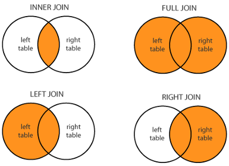

# Data Wrangling with Tidy Data, Part 2

```{r, echo=F, message=F, warning=F, error=F}
install.packages("palmerpenguins")
```

## Datasets within DepMap Project

The [Dependency Map project](https://depmap.org/portal/) is a multi-omics profiling of cancer cell lines combined with functional assays such as CRISPR and drug sensitivity to help identify cancer vulnerabilities and drug targets. Here are some of the data that we have public access.

-   Metadata

-   Somatic mutations

-   Gene expression

-   Drug sensitivity

-   CRISPR knockout

-   and more...

## Data Science Workflow

{width="550"}

We are now equipped with enough fundamental programming skills to apply it to various steps in the data science workflow. We start with *Transform* and *Visualize* with the assumption that our data is in a nice, "tidy format". First, we need to understand what it means for a data to be "tidy".

## Describing a tidy dataset

Here, we describe a standard of organizing data. It is important to have standards, as it facilitates a consistent way of thinking about data organization and building tools (functions) that make use of that standard. The principles of **tidy data**, developed by Hadley Wickham:

1.  Each variable is a column; each column is a variable.

2.  Each observation is a row; each row is an observation.

3.  Each value is a cell; each cell is a single value.

If you want to be technical about what variables and observations are, Hadley Wickham describes:

> A **variable** contains all values that measure the same underlying attribute (like height, temperature, duration) across units. An **observation** contains all values measured on the same unit (like a person, or a day, or a race) across attributes.

{width="800"}

### Examples of Tidy data

Let's practice describing the observations, variables, and values of tidy dataframes:

```{r, message=FALSE}
library(tidyverse)
library(palmerpenguins)
load(url("https://github.com/caalo/Intro_to_R/raw/main/classroom_data/CCLE.RData"))
```

| Dataframe  | The observation is | Some variables are            | Some values are             |
|------------------|------------------|-------------------|------------------|
| metadata   | Cell line          | ModelID, Age, OncotreeLineage | "ACH-000001", 60, "Myeloid" |
| expression |                    |                               |                             |
| mutation   |                    |                               |                             |
| penguins   |                    |                               |                             |
| table1     |                    |                               |                             |

## Transform

When given a tidy dataset, we often still have to do some transformations on it to get it in a form so that we can perform our analysis and visualization. Here are some common transformation tasks:

### "The rows and columns I need can be subsetted from the dataframe."

We use `filter()` and `select()` as we have learned already.

```{r}
breast_metadata = metadata %>% filter(OncotreeLineage == "Breast") %>%
                             select(ModelID, Age, Sex)
```

### "The column I want is an operation or function of other columns I already have in the dataframe."

We use `mutate()` or `$` operation as we have learned already.

```{r}
expression = expression %>% mutate(log_PIK3CA_Exp = log(PIK3CA_Exp))
#or
expression$log_PIK3CA_Exp = log(expression$PIK3CA_Exp)
```

### "The columns that I need are in two different dataframes with a common column. The rows (observations) of both dataframes represent the same thing."

Suppose we have the following dataframes:

`expression`

| ModelID      | PIK3CA_Exp | log_PIK3CA_Exp |
|--------------|------------|----------------|
| "ACH-001113" | 5.138733   | 1.636806       |
| "ACH-001289" | 3.184280   | 1.158226       |
| "ACH-001339" | 3.165108   | 1.152187       |

`metadata`

| ModelID      | OncotreeLineage | Age |
|--------------|-----------------|-----|
| "ACH-001113" | "Lung"          | 69  |
| "ACH-001289" | "CNS/Brain"     | NA  |
| "ACH-001339" | "Skin"          | 14  |

Suppose that I want to compare the relationship between `OncotreeLineage` and `PIK3CA_Exp`, but they are columns in different dataframes. We want a new dataframe that looks like this:

| ModelID      | PIK3CA_Exp | log_PIK3CA_Exp | OncotreeLineage | Age |
|--------------|------------|----------------|-----------------|-----|
| "ACH-001113" | 5.138733   | 1.636806       | "Lung"          | 69  |
| "ACH-001289" | 3.184280   | 1.158226       | "CNS/Brain"     | NA  |
| "ACH-001339" | 3.165108   | 1.152187       | "Skin"          | 14  |

We see that in both dataframes, the rows (observations) represent cell lines with a common column `ModelID`, so let's merge these two dataframes together, using `full_join()`:

```{r}
merged = full_join(metadata, expression, by = "ModelID")
```

The number of rows and columns of `metadata`:

```{r}
dim(metadata)
```

The number of rows and columns of `expression`:

```{r}
dim(expression)
```

The number of rows and columns of `merged`:

```{r}
dim(merged)
```

We see that the number of *columns* in `merged` combines the number of columns in `metadata` and `expression`, while the number of *rows* in `merged` is the larger of the number of rows in `metadata` and `expression` : `full_join()` keeps all observations common to both dataframes based on the common column defined via the `by` argument.

Therefore, we expect to see `NA` values in `merged`, as there are some cell lines that are not in `expression` dataframe.

There are variations of this function depending on your application:



Given `xxx_join(x, y, by = "common_col")`,

-   `full_join()` keeps all observations.

-   `left_join()` keeps all observations in `x`.

-   `right_join()` keeps all observations in `y`.

-   `inner_join()` keeps observations common to both `x` and `y`.

### "The rows I want is described by a column. The columns I want need to be summarized from other columns."

In a dataset, there may be multiple levels of observations, and which level of observation we examine depends on our scientific question. For instance, in `metadata`, the observation is cell lines. However, perhaps we want to understand properties of `metadata` in which the observation is the cancer type, `OncotreeLineage`. Suppose we want the mean age of each cancer type, and the number of cell lines that we have for each cancer type. This is a scenario in which the *desired rows are described by a column*, `OncotreeLineage`, and the columns, such as mean age, need to be *summarized from other columns.*

As an example, this dataframe is transformed from:

| ModelID      | OncotreeLineage | Age |
|--------------|-----------------|-----|
| "ACH-001113" | "Lung"          | 69  |
| "ACH-001289" | "Lung"          | 23  |
| "ACH-001339" | "Skin"          | 14  |
| "ACH-002342" | "Brain"         | 23  |
| "ACH-004854" | "Brain"         | 56  |
| "ACH-002921" | "Brain"         | 67  |

into:

| OncotreeLineage | MeanAge | Count |
|-----------------|---------|-------|
| "Lung"          | 46      | 2     |
| "Skin"          | 14      | 1     |
| "Brain"         | 48.67   | 3     |

We use the functions `group_by()` and `summarise()` :

```{r}
metadata_by_type = metadata %>% 
                   group_by(OncotreeLineage) %>% 
                   summarise(MeanAge = mean(Age),
                             Count = n())
```

The `group_by()` function returns the identical input dataframe but remembers which variable(s) have been marked as grouped.

The `summarise()` returns one row for each combination of grouping variables, and one column for each of the summary statistics that you have specified.

## Tidy Data Tutor

Guest speaker: [Sean Kross](https://seankross.com/), author of [Tidy Data Tutor](https://tidydatatutor.com/).
