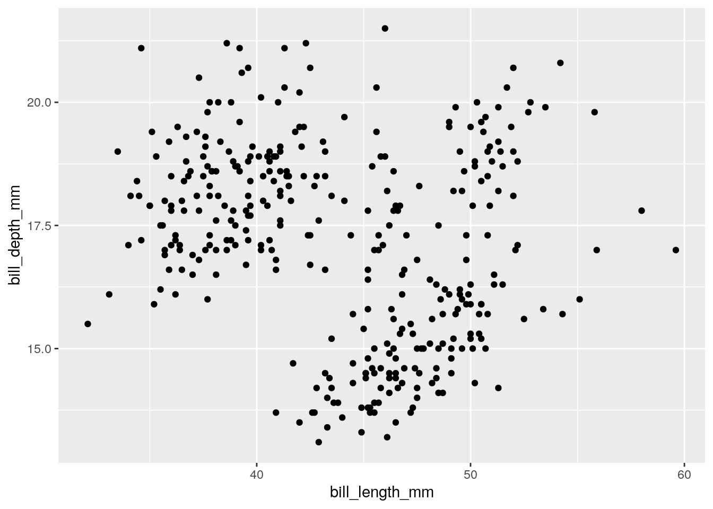
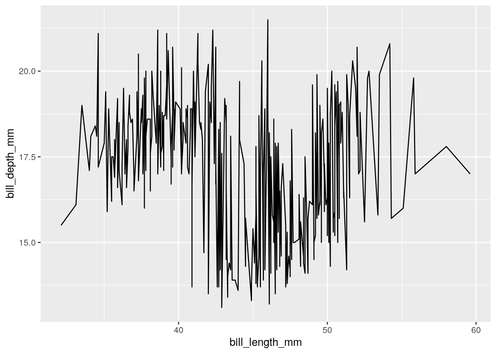

# Data Visualization


```
## 
## The downloaded binary packages are in
## 	/var/folders/pq/18p2fl6n49dfgzd03mtszm6r0000gn/T//RtmpvFOvIJ/downloaded_packages
```


Now that we have learned basic data structures in R, we can now learn about how to do visualize our data. There are several different data visualization tools in R, and we focus on one of the most popular, "Grammar of Graphics", or known as "ggplot". 

The syntax for `ggplot` will look a bit different than the code we have been writing, with syntax such as: 


``` r
ggplot(penguins) + aes(x = bill_length_mm) + geom_histogram() 
```

```
## `stat_bin()` using `bins = 30`. Pick better value with `binwidth`.
```

```
## Warning: Removed 2 rows containing non-finite outside the scale range
## (`stat_bin()`).
```


The output of all of these functions, such as from `ggplot()` or `aes()` are not data types or data structures that we are familiar with...rather, they are graphical information. 

You should be worried less about how this syntax is similar to what we have learned in the course so far, but to view it as a new grammar (of graphics!) that you can "layer" on to create more sophisticated plots.


To get started, we will consider these most simple and common plots:

**Univariate**

-   Numeric: histogram
-   Character: bar plots

**Bivariate**

-   Numeric vs. Numeric: Scatterplot, line plot
-   Numeric vs. Character: Box plot

Why do we focus on these common plots? Our eyes are better at distinguishing certain visual features more than others. All of these plots are focused on their position to depict data, which gives us the most effective visual scale.


## Grammar of Graphics

The syntax of the grammar of graphics breaks down into 4 sections.

[Data]{style="color:orange"}

[Mapping to data]{style="color:green"}

[Geometry]{style="color:blue"}

[Additional settings]{style="color:purple"}

You add these 4 sections together to form a plot.

### Histogram

[ggplot(penguins)]{style="color:orange"} + [aes(x = bill_length_mm)]{style="color:green"} + [geom_histogram()]{style="color:blue"} + [theme_bw()]{style="color:purple"}


With options:

[ggplot(penguins)]{style="color:orange"} + [aes(x = bill_length_mm)]{style="color:green"} + [geom_histogram(binwidth = 5)]{style="color:blue"} + [theme_bw()]{style="color:purple"}


### Bar plots

[ggplot(penguins)]{style="color:orange"} + [aes(x = species)]{style="color:green"} + [geom_bar()]{style="color:blue"}


### Scatterplot

[ggplot(penguins)]{style="color:orange"} + [aes(x = bill_length_mm, y = bill_depth_mm)]{style="color:green"} + [geom_point()]{style="color:blue"}


### Multivaraite Scatterplot

[ggplot(penguins)]{style="color:orange"} + [aes(x = bill_length_mm, y = bill_depth_mm, color = species)]{style="color:green"} + [geom_point()]{style="color:blue"}


### Multivaraite Scatterplot

[ggplot(penguins)]{style="color:orange"} + [aes(x = bill_length_mm, y = bill_depth_mm)]{style="color:green"} + [geom_point()]{style="color:blue"} + [facet_wrap(\~species)]{style="color:purple"}



### Line plot?

[ggplot(penguins)]{style="color:orange"} + [aes(x = bill_length_mm, y = bill_depth_mm)]{style="color:green"} + [geom_line()]{style="color:blue"}


### Grouped Line plot?

[ggplot(penguins)]{style="color:orange"} + [aes(x = bill_length_mm, y = bill_depth_mm, group = species)]{style="color:green"} + [geom_line()]{style="color:blue"}


### Boxplot

[ggplot(penguins)]{style="color:orange"} + [aes(x = species, y = bill_depth_mm)]{style="color:green"} + [geom_boxplot()]{style="color:blue"}



### Grouped Boxplot

[ggplot(penguins)]{style="color:orange"} + [aes(x = species, y = bill_depth_mm, color = island)]{style="color:green"} + [geom_boxplot()]{style="color:blue"}


### Some additional options

[ggplot(data = penguins)]{style="color:orange"} + [aes(x = bill_length_mm, y = bill_depth_mm, color = species)]{style="color:green"} + [geom_point()]{style="color:blue"} + [labs(x = "Bill Length", y = "Bill Depth", title = "Comparison of penguin bill length and bill depth across species") + scale_x_continuous(limits = c(30, 60))]{style="color:purple"}


## Summary of options

[data]{style="color:orange"}

\
[geom_point]{style="color:blue"}: [x, y, color, shape]{style="color:green"}

[geom_line]{style="color:blue"}: [x, y, group, color]{style="color:green"}

[geom_histogram]{style="color:blue"}: [x, y, fill]{style="color:green"}

[geom_bar]{style="color:blue"}: [x, fill]{style="color:green"}

[geom_boxplot]{style="color:blue"}: [x, y, fill, color]{style="color:green"}

\
[facet_wrap]{style="color:purple"}

\
[labs]{style="color:purple"}

[scale_x_continuous]{style="color:purple"}

[scale_y_continuous]{style="color:purple"}

[scale_x_discrete]{style="color:purple"}

[scale_y_discrete]{style="color:purple"}

Consider the `esquisse` package to help generate your ggplot code via drag and drop.

An excellent ggplot "cookbook" can be found [here](https://r-graphics.org/).

## Exercises

You can find [exercises and solutions on Posit Cloud](https://posit.cloud/content/8245357), or on [GitHub](https://github.com/fhdsl/Intro_to_R_Exercises).
