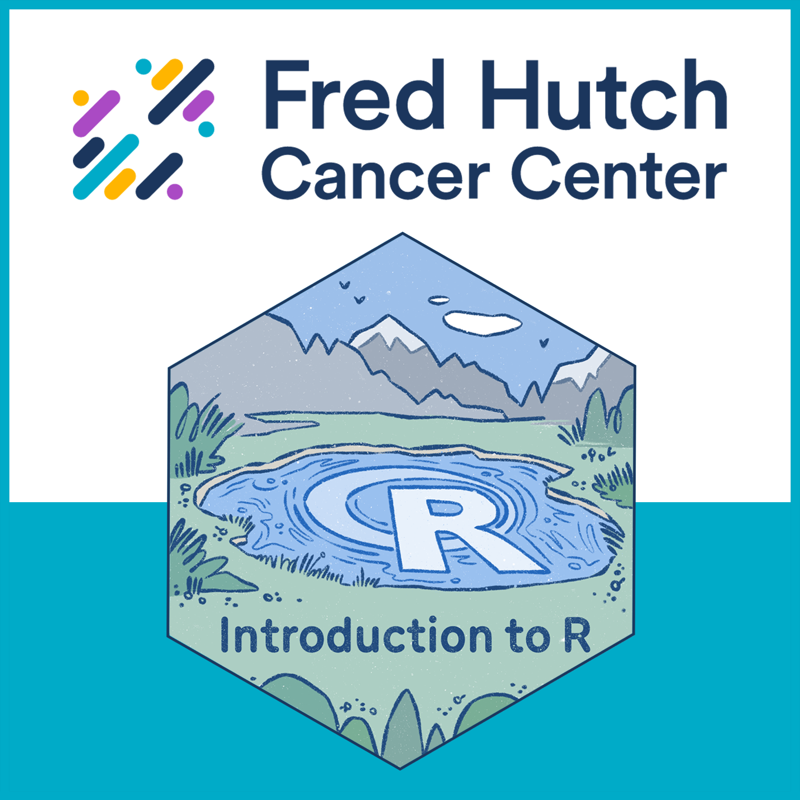

## Welcome!

.png){width="600"}

Please [sign-up for an account at Posit Cloud](https://login.posit.cloud/register "https://login.posit.cloud/register") and accept our classroom invitation here: <https://posit.cloud/spaces/778567/join?access_code=cHS7GvIehPSq0Nwv__F1a84dieZtKLKs0lajQWyC>. 

## Introductions

-   Who am I?

. . .

-   What is [DaSL](https://hutchdatascience.org/) / [OCDO](https://ocdo.fredhutch.org/) ?

. . .

-   Who are you?

    -   Name, pronouns, group you work in

    -   What you want to get out of the class

    -   Something that is sprouting for you in the spring!

. . .

-   Our wonderful TA!

## Goals of the course

. . .

-   Fundamental concepts in programming languages: *How do programs run, and how do we solve problems effectively using functions and data structures?*

. . .

-   Data science fundamentals: *How do you translate your scientific question to a data wrangling problem and answer it?*

    {width="550"}

## Content of the course

1.  Intro to Computing

2.  Data structures

3.  Data wrangling 1

4.  Data wrangling 2

5.  Data visualization

6.  Wrap-up, Pizza!

## Culture of the course

. . .

-   Challenge: We are learning a new language, but you already have a full-time job.

. . .

-   *Teach not for mastery, but teach for empowerment to learn effectively.*

. . .

-   *Teach at learner's pace.*

## Culture of the course

-   Challenge: We sometimes struggle with our data science problems in isolation, unaware that other folks are working on similar things.

. . .

-   *We learn and work better with our peers.*

. . .

-   *We encourage discussion and questions, as others often have similar questions also.*

## Format of the course

. . .

-   Hybrid, and recordings will be available.

. . .

-   1 hour exercises after each session are encouraged for practice.

. . .

-   Office hours 11:30-Noon before class.

## Badge of completion

{width="450"}

We offer a [badge of completion](https://www.credly.com/org/fred-hutch/badge/intro-to-r) when you finish the course!

What it is:

-   A display of what you accomplished in the course, shareable in your professional networks such as LinkedIn, similar to online education services such as Coursera.

What it isn't:

-   Accreditation through an university or degree-granting program.

. . .

Requirements:

-   Complete badge-required sections of the exercises for 4 out of 5 assignments.

## Ready?


## What is a computer program?

. . .

-   A *sequence* of instructions to manipulate data for the computer to execute.

. . .

-   A series of *translations*: English \<-\> Programming Code for R Console \<-\> Machine Code

. . .

For example:

```{r, warning=FALSE}
library(tidyverse)
iris_filtered = filter(iris, Sepal.Width > 2)
mean(iris_filtered$Sepal.Width)
```

## Setting up Posit Cloud and trying out your first analysis!

[Classroom link here.](https://posit.cloud/spaces/778567/join?access_code=cHS7GvIehPSq0Nwv__F1a84dieZtKLKs0lajQWyC)

Open up "Week 1 Classwork" once you are in the classroom.

Then open up "KRAS.qmd" document in the file browser in the right bottom corner.

## Break

Pre-course survey here: <https://forms.gle/puE8W5BeYyTYJjdm8>

## Grammar Structure 1: Evaluation of Expressions

Consider the expression:

```{r}
max(18, 21)
```

. . .

-   **Expressions** are built out of **functions** or **operations**.

. . .

-   Functions and operations take in **data types** as inputs, and **return** another data type as output.

. . .

-   If the function or operation input contains expressions, evaluate those expressions first.

## Examples

```{r}
18 + 21
```

. . .

```{r}
max(18, 21)
```

. . .

```{r}
max(18 + 21, 65)
```

. . .

Parenthesis changes the order of operation:

```{r}
18 * (21 + 65)
```

. . .

Compare with:

```{r}
(18 * 21) + 65
```

. . .

What's this?

```{r}
nchar("ATCG")
```

## Interpreting functions and operations

-   To use a function or operation, we only need to know what the expected inputs and outputs are. The inner workings doesn't matter - it is modular.

. . .

-   A function or operation can have different kinds of inputs and outputs - it doesn't need to be numbers.

## Data types

-   **Numeric**: 18, -21, 65, 1.25

-   **Character**: "ATCG", "Whatever", "948-293-0000"

-   **Logical**: TRUE, FALSE

## Grammar Structure 2: Storing variables in the environment

. . .

To build up a computer program, we need to store our returned data type from our expression somewhere for downstream use.

```{r}
age = 18 + 21
```

. . .

Evaluate the expression to the right of `=`.

Bind variable on the left of `=` to the resulting value.

Then the variable is stored in the **environment**.

## Downstream

Look, now `age` can be reused downstream:

```{r}
age - 2
```

. . .

```{r}
age_double = age * 2
age_double
```

. . .

`age_double` depends on `age`, so the order of code run matters.

. . .

What's the data type of a variable?

```{r}
class(age_double)
```

## More practice

```{r}
(sqrt(nchar("hello")) + 4) * (2 + 4)
```

. . .

```{r}
brothers_age = 45
grandmas_age = 90
age = max(brothers_age, grandmas_age)
secret = (nchar("hello") + age) * (2 + 4)
secret
```

. . .

```{r}
brothers_age = brothers_age + 1
grandmas_age = grandmas_age + 1
```

## Tips on writing your first code

. . .

`Computer = powerful + stupid`

. . .

-   Break down complex expressions: if `my_function(a, b + c)` isn't working, examine `a` and `b + c`

. . .

-   The sequence of instructions you give matters! Refresh the page, or click the broom button, to clear the environment.

. . .

-   **Ask for help!**
