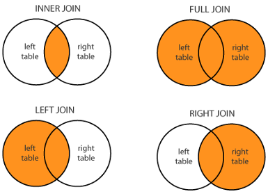

```{r, echo=F, message=F, warning=F, error=F}
library(palmerpenguins)
library(tidyverse)
load(url("https://github.com/fhdsl/Intro_to_R/raw/main/classroom_data/CCLE.RData"))
```

## Cheatsheet!

<https://hutchdatascience.org/Intro_to_R/cheatsheet.html>

## How to learn a new function?

```         
?mean
```

[Online documentation](https://stat.ethz.ch/R-manual/R-devel/library/base/html/mean.html)

. . .

```         
mean(x, trim = 0, na.rm = FALSE, ...)
```

The inputs to a function always have input names:

-   `x`. This input is required.

-   `trim`. This input is optional (it has a default input value).

-   `na.rm`. This input is optional (it has a default input value).

-   `...` indicates optional unnamed inputs.

. . .

When the input name is not specified, the order implies the input! The following usages are equivalent:

`mean(df$column, na.rm = TRUE)`

`mean(x = df$column, na.rm = TRUE)`

`mean(df$column, 0, TRUE)`

`mean(trim = 0, x = df$column, na.rm = TRUE)`

## Review: When do you refer columns with a `$`?

. . .

[Tidyverse](https://tidyverse.org/packages/) Dataframe functions, such as `select()`, `filter()`, `mutate()`, `group_by()`, `summarize()` allows you to refer columns without `$`:

```         
select(penguins, species, island)

filter(penguins, species == "Adelie")

mutate(penguins, new_col = log(body_mass_g))
```

. . .

All other functions and operations require `$` as a reference:

```         
mean(penguins$body_mass_g, na.rm = TRUE)

table(penguins$island)

island = penguins$island
island[island == "Torgersen"]
```

## Modifying and creating new columns

. . .

The [`mutate()`](https://dplyr.tidyverse.org/reference/mutate.html) function takes in the following arguments: the first argument is the dataframe of interest, and the second argument is a *new or existing data variable* that is defined in terms of *other data variables*.

. . .

```{r}
metadata$Age[1:10]
```

. . .

```{r}
metadata2 = mutate(metadata, olderAge = Age + 10)
```

. . .

```{r}
metadata2$olderAge[1:10]
```

. . .

<br>

```{r}
expression$KRAS_Exp[1:10]
```

. . .

```{r}
expression2 = mutate(expression, log_KRAS_Exp = log(KRAS_Exp))
```

. . .

```{r}
expression2$log_KRAS_Exp[1:10]
```

## Modifying and creating new columns

. . .

Instead of `mutate()` function, we can also create a new or modify a column via the `$` symbol:

```{r}
expression$KRAS_Exp[1:10]
```

. . .

```{r}
expression2 = expression
expression2$log_KRAS_Exp = log(expression2$KRAS_Exp)
```

. . .

```{r}
expression2$log_KRAS_Exp[1:10]
```

## Merging two dataframes together

```{r}
simple_df = data.frame(id = c("AAA", "BBB", "CCC", "DDD", "EEE"),
                       case_control = c("case", "case", "control", "control", "control"),
                       measurement1 = c(2.5, 3.5, 9, .1, 2.2),
                       measurement2 = c(0, 0, .5, .24, .003),
                       measurement3 = c(80, 2, 1, 1, 2))

simple_df
```

. . .

```{r}
simple2_df = data.frame(id = c("AAA", "EEE", "FFF", "GGG", "HHH"),
                        measurement4 = c(25, 23, 56, 23, 9),
                        measurement5 = c(TRUE, TRUE, TRUE, FALSE, FALSE))
simple2_df
```

## Merging two dataframes together

```{r}
merged = full_join(simple_df, simple2_df, by = join_by(id))
merged
```

## Merging two dataframes together

. . .

`expression`

| ModelID      | PIK3CA_Exp | log_PIK3CA_Exp |
|--------------|------------|----------------|
| "ACH-001113" | 5.138733   | 1.636806       |
| "ACH-001289" | 3.184280   | 1.158226       |
| "ACH-001339" | 3.165108   | 1.152187       |

. . .

`metadata`

| ModelID      | OncotreeLineage | Age |
|--------------|-----------------|-----|
| "ACH-001113" | "Lung"          | 69  |
| "ACH-001289" | "CNS/Brain"     | NA  |
| "ACH-001339" | "Skin"          | 14  |

. . .

Merged:

| ModelID      | PIK3CA_Exp | log_PIK3CA_Exp | OncotreeLineage | Age |
|--------------|------------|----------------|-----------------|-----|
| "ACH-001113" | 5.138733   | 1.636806       | "Lung"          | 69  |
| "ACH-001289" | 3.184280   | 1.158226       | "CNS/Brain"     | NA  |
| "ACH-001339" | 3.165108   | 1.152187       | "Skin"          | 14  |

## Merging two dataframes together

We see that in both dataframes, the rows (observations) represent cell lines with a common column `ModelID`, so let's merge these two dataframes together, using `full_join()`:

```{r}
merged = full_join(metadata, expression, by = join_by(ModelID))
```

. . .

Let's take a look at the dimensions:

. . .

```{r}
dim(metadata)
```

. . .

```{r}
dim(expression)
```

. . .

```{r}
dim(merged)
```

. . .

`full_join()` keeps all observations common to both dataframes based on the common column defined via the `by` argument.

. . .

Therefore, we expect to see `NA` values in `merged`, as there are some cell lines that are not in `expression` dataframe.

## Merging two dataframes together: variations



. . .

Given `xxx_join(x, y, by = join_by(common_col))`,

-   `full_join()` keeps all observations.

-   `left_join()` keeps all observations in `x`.

-   `right_join()` keeps all observations in `y`.

-   `inner_join()` keeps observations common to both `x` and `y`.

## Grouping and summarizing dataframes

. . .

| ModelID      | OncotreeLineage | Age |
|--------------|-----------------|-----|
| "ACH-001113" | "Lung"          | 69  |
| "ACH-001289" | "Lung"          | 23  |
| "ACH-001339" | "Skin"          | 14  |
| "ACH-002342" | "Brain"         | 23  |
| "ACH-004854" | "Brain"         | 56  |
| "ACH-002921" | "Brain"         | 67  |

. . .

Desired rows: cancer subtype.

Desired columns: mean age.

| OncotreeLineage | MeanAge | Count |
|-----------------|---------|-------|
| "Lung"          | 46      | 2     |
| "Skin"          | 14      | 1     |
| "Brain"         | 48.67   | 3     |

. . .

To get there, we need to:

-   **Group** the data based on some criteria: elements of `OncotreeLineage`

-   **Summarise** each group via a summary statistic performed on a column: `Age`.

## Grouping and summarizing dataframes

```{r}
metadata_grouped = group_by(metadata, OncotreeLineage)
metadata_type = summarise(metadata_grouped, MeanAge = mean(Age, na.rm = TRUE))
```

. . .

```{r}
head(metadata_type)
```

## Grouping and summarizing dataframes

The `group_by()` function returns the identical input dataframe but remembers which variable(s) have been marked as grouped.

. . .

The `summarise()` returns one row for each combination of grouping variables, and one column for each of the summary statistics that you have specified.

. . .

Functions you can use for `summarise()` must take in a vector and return a simple data type, such as any of our summary statistics functions: `mean()`, `median()`, `min()`, `max()`, etc.

. . .

The exception is `n()`, which returns the number of entries for each grouping variable's value.

## Code readability with many nested functions

When combining multiple functions in one expression, it gets harder to read:

. . .

```{r}
breast_metadata = select(filter(metadata, OncotreeLineage == "Breast"), ModelID, Age, Sex)
```

. . .

Or, this: 🤨

```         
result2 = function1(function2(function3(dataframe)))
```

. . .

Or... 🤕

```         
result = function1(function2(function3(dataframe, df_col4, df_col2), arg2), df_col5, arg1)
```

## Pipes to make nested functions readable

. . .

```         
result2 = dataframe |> function1 |> function2 |> function3
```

. . .

```         
result = function1(df_col5, arg1) |>
         function2(arg2) |>
         function3(df_col4, df_col2)
```

. . .

Rewrite the `select()` and `filter()` function composition example above using the pipe metaphor and syntax.

. . .

```{r}
breast_metadata = metadata |> filter(OncotreeLineage == "Breast") |> select(ModelID, Age, Sex)
```

🤠

. . .

Group by and summarise with pipes:

```{r}
metadata_by_type = metadata |> 
                   group_by(OncotreeLineage) |> 
                   summarise(MeanAge = mean(Age, na.rm = TRUE),
                             Count = n())
```

## Appendix: More data wrangling functions from Tidyverse

<https://dplyr.tidyverse.org/articles/dplyr.html>
